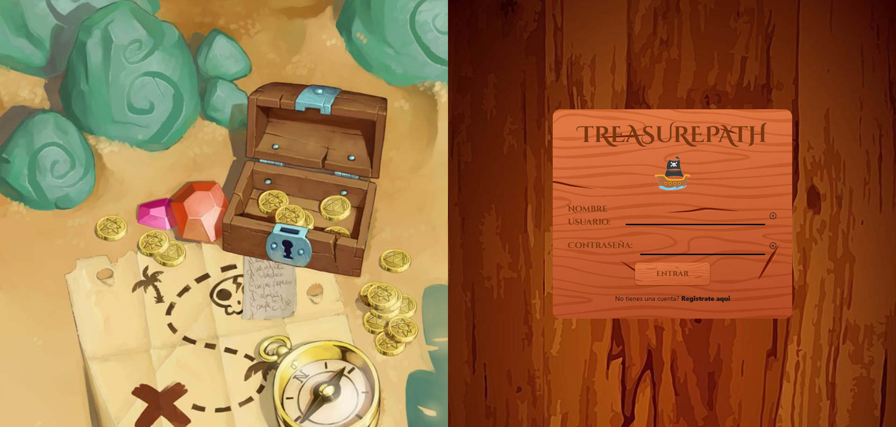
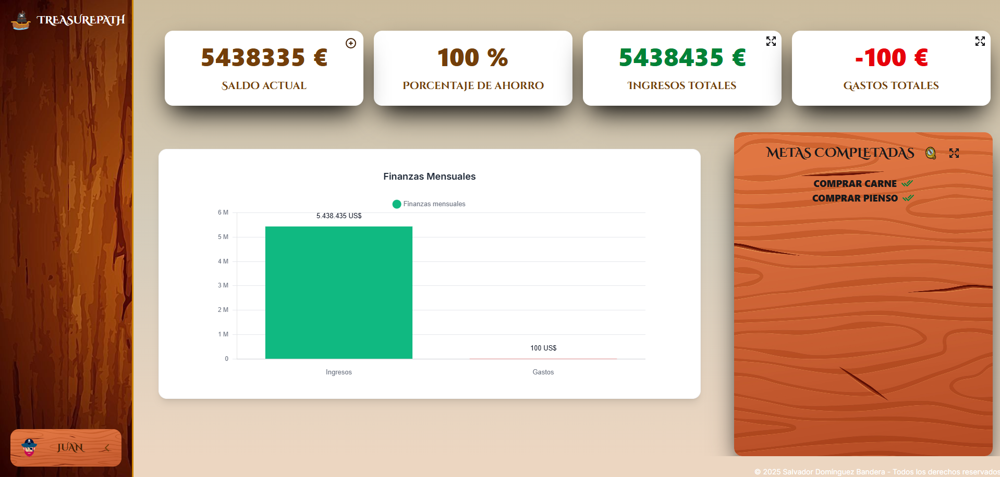
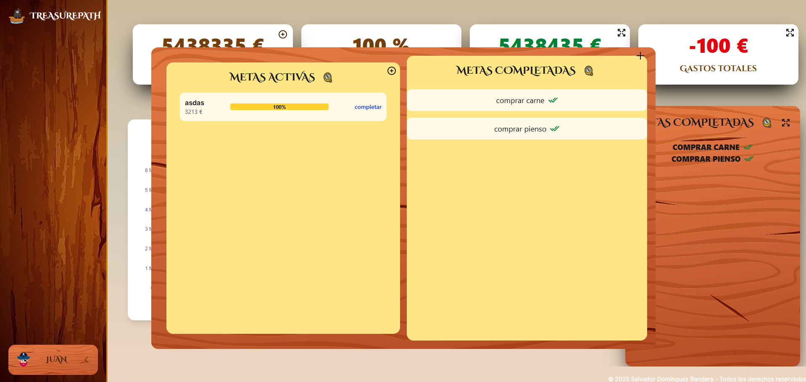
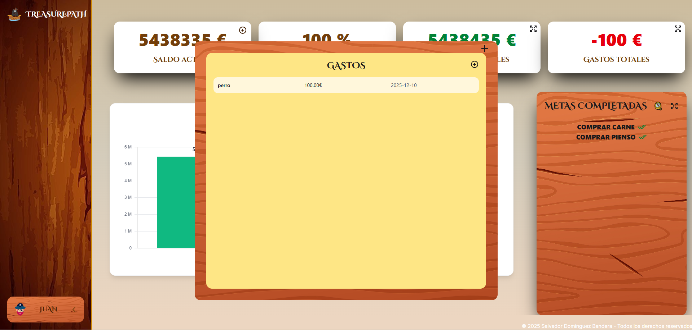

# 🏴‍☠️ TreasurePath

**TreasurePath** es una aplicación web de gestión de finanzas personales orientada a usuarios principiantes.
Permite registrar ingresos, gastos y metas de ahorro mediante una interfaz visual intuitiva con temática pirata.

## 🚀 Demo

⚠️ Actualmente en desarrollo (UI en proceso de rediseño en rama `ui-redisin`)

## 📸 Capturas de pantalla

*Añade aquí tus capturas actualizadas del dashboard, gráficos y gestión de metas*

### Inicio de sesión.
     
### Página de Registro.
    
###  Interfaz Prinicpal.
    
### Interfaz Metas.
    
### Interfaz Gastos.
    
es que 
## 🛠️ Tecnologías utilizadas

### Frontend

* Vue 3
* TypeScript
* TailwindCSS
* Vue Router
* Chart.js

### Backend

* PHP
* MySQL

### Herramientas

* Vite
* XAMPP
* MySQL Workbench
* Visual Studio Code

## ⚙️ Instalación y uso

### 1. Clonar el repositorio

git clone https://github.com/sdbxl8/TreasurePath.git
cd TreasurePath

### 2. Cambiar a la rama de desarrollo (UI actual)

git checkout ui-redisin

### 3. Instalar dependencias

npm install

### 4. Configurar entorno local

* Iniciar **Apache** y **MySQL** desde XAMPP
* Acceder a **phpMyAdmin**

### 5. Importar la base de datos

* Importar el archivo:

database/treasurepath.sql

### 6. Ejecutar la aplicación

'npm run dev'

Abrir el enlace proporcionado en la terminal.

## 🧠 Objetivo del proyecto

El objetivo de TreasurePath es facilitar la gestión financiera personal a usuarios sin experiencia, proporcionando una herramienta sencilla, visual y accesible para el control de ingresos, gastos y metas de ahorro.

---

## 📊 Funcionalidades

* Registro e inicio de sesión de usuarios
* Gestión de sesiones
* Registro de ingresos y gastos
* Visualización de balance y estadísticas
* Sistema de metas con seguimiento de progreso

---

## 🧪 Pruebas realizadas

* Pruebas funcionales basadas en casos de uso
* Pruebas de interfaz de usuario
* Pruebas de seguridad
* Pruebas de rendimiento

---

## 🧠 Aprendizajes

* Desarrollo de aplicaciones SPA con Vue 3
* Uso de TypeScript para tipado seguro
* Integración frontend-backend
* Diseño y gestión de bases de datos relacionales
* Implementación de gráficos dinámicos con Chart.js
* Mejora de UI/UX mediante iteración y rediseño

---

## 📈 Futuras mejoras

* 🌐 Despliegue en servidor real
* 📱 Versión móvil
* ⚙️ Personalización avanzada
* 📊 Estadísticas más completas
* 🔗 Integración bancaria

## 👨‍💻 Autor

Salvador Domínguez Bandera

## 📌 Estado del proyecto

🚧 Proyecto en desarrollo (rediseño de interfaz en progreso)
✅ Versión funcional disponible en entorno local
